# 🏠 Real Estate Advertising Platform

<div align="center">


**A comprehensive real estate advertising platform with a 4-step wizard flow for creating and purchasing Facebook advertising campaigns.**

[🚀 Live Demo](#-quick-start) • [📖 Documentation](#-documentation) • [🛠 API Reference](#-api-reference) • [🤝 Contributing](#-contributing)

</div>

---

## 📋 Table of Contents

- [Overview](#-overview)
- [Features](#-features)
- [Quick Start](#-quick-start)
- [Project Structure](#-project-structure)
- [Application Flow](#-application-flow)
- [Technology Stack](#-technology-stack)
- [API Reference](#-api-reference)
- [Testing](#-testing)
- [Configuration](#-configuration)
- [Deployment](#-deployment)
- [Contributing](#-contributing)
- [License](#-license)

## 🎯 Overview

This platform enables real estate agents to create targeted Facebook advertising campaigns through an intuitive 4-step process. Built with modern web technologies, it features a complete mock backend API, type-safe frontend integration, and comprehensive testing tools.

### Key Capabilities
- **MLS Integration**: Verify agent credentials across 6 major MLS providers
- **Campaign Creation**: Choose between Zip Code Blast and Listing Blast campaigns
- **Real-time Preview**: See how ads will appear on Facebook before publishing
- **Payment Processing**: Complete checkout flow with billing and payment options
- **Cost Calculation**: Dynamic pricing based on campaign duration and type

## ✨ Features

### 🎨 Frontend Features
- ✅ **Responsive Design**: Mobile-first approach with pixel-perfect UI
- ✅ **4-Step Wizard**: Intuitive flow with progress tracking
- ✅ **Real-time Validation**: Instant feedback on form inputs
- ✅ **Loading States**: Smooth user experience with loading indicators
- ✅ **Error Handling**: Comprehensive error messages and recovery
- ✅ **Form Persistence**: Auto-save form data in local storage
- ✅ **TypeScript**: Full type safety throughout the application

### 🔧 Backend Features
- ✅ **RESTful API**: 15+ endpoints covering all application needs
- ✅ **Mock Database**: Realistic test data for development
- ✅ **CORS Support**: Configured for cross-origin requests
- ✅ **Error Simulation**: Test error scenarios and edge cases
- ✅ **API Delays**: Realistic response times for testing
- ✅ **Data Validation**: Server-side validation and sanitization

### 🧪 Testing & Development
- ✅ **API Test Interface**: Interactive endpoint testing at `/api-test`
- ✅ **Comprehensive Documentation**: Detailed guides and examples
- ✅ **Development Tools**: Hot reload, debugging, and monitoring
- ✅ **Mock Data**: Complete test datasets for all scenarios

## 🚀 Quick Start

### Prerequisites
- **Node.js** 18.0 or higher
- **npm** 9.0 or higher (or **yarn** 1.22+)
- **Git** for version control

### Installation

1. **Clone the repository**
   ```bash
   git clone https://github.com/kratos06/dailyworks.git
   cd dailyworks
   ```

2. **Install dependencies**
   ```bash
   npm install
   ```

3. **Set up environment variables**
   ```bash
   cp .env.local.example .env.local
   # Edit .env.local with your configuration
   ```

4. **Start the development servers**
   ```bash
   # Start both frontend and backend
   npm run dev:full

   # Or start individually
   npm run dev          # Frontend only (port 3000)
   npm run mock-server  # Backend only (port 3001)
   ```

### 🌐 Access Points

| Service | URL | Description |
|---------|-----|-------------|
| **Main Application** | http://localhost:3000 | Complete 4-step wizard flow |
| **API Test Interface** | http://localhost:3000/api-test | Interactive API testing |
| **Mock Server** | http://localhost:3001/api | Backend API endpoints |
| **Health Check** | http://localhost:3001/api/packages | Quick server status |

### ⚡ Quick Verification

Test that everything is working:

```bash
# Test the mock server
curl http://localhost:3001/api/packages

# Expected response: JSON array with package data
```

## 📁 Project Structure

```
dailyworks/
├── 📁 app/                          # Next.js 14 App Router
│   ├── 📁 mls-verification/         # Step 1: MLS credential verification
│   ├── 📁 ads-preview/              # Step 2: Facebook ad preview
│   ├── 📁 package-confirmation/     # Step 3: Package selection & targeting
│   ├── 📁 checkout/                 # Step 4: Payment & order completion
│   ├── 📁 api-test/                 # Interactive API testing interface
│   ├── 📄 layout.tsx                # Root layout component
│   ├── 📄 page.tsx                  # Home page (redirects to step 1)
│   └── 📄 globals.css               # Global styles and CSS variables
│
├── 📁 components/                   # React Components
│   ├── 📁 ui/                       # Reusable UI components
│   │   ├── 📄 Button.tsx            # Custom button component
│   │   ├── 📄 Input.tsx             # Form input component
│   │   ├── 📄 Select.tsx            # Dropdown select component
│   │   └── 📄 Modal.tsx             # Modal dialog component
│   ├── 📄 MlsVerificationForm.tsx   # Original MLS form (static data)
│   ├── 📄 MlsVerificationFormWithAPI.tsx # API-integrated MLS form
│   ├── 📄 AdsPreviewForm.tsx        # Facebook ad preview component
│   ├── 📄 PackageConfirmationForm.tsx # Original package form
│   ├── 📄 PackageConfirmationFormWithAPI.tsx # API-integrated package form
│   ├── 📄 CheckoutForm.tsx          # Payment and checkout form
│   ├── 📄 ListingSelectionModal.tsx # Property listing selection
│   ├── 📄 PersonalInfoModal.tsx     # User information modal
│   └── 📄 SuccessModal.tsx          # Order confirmation modal
│
├── 📁 lib/                          # Core Libraries
│   └── 📄 api.ts                    # Type-safe API service layer
│
├── 📁 hooks/                        # Custom React Hooks
│   └── 📄 useApi.ts                 # API state management hooks
│
├── 📁 mock-server/                  # Express.js Mock Backend
│   ├── 📄 server.js                 # Express server implementation
│   ├── 📄 db.json                   # Mock database with test data
│   └── 📄 README.md                 # API endpoint documentation
│
├── 📄 package.json                  # Project dependencies and scripts
├── 📄 tsconfig.json                 # TypeScript configuration
├── 📄 next.config.js                # Next.js configuration
├── 📄 .env.local                    # Environment variables
├── 📄 .gitignore                    # Git ignore rules
├── 📄 README.md                     # This file
└── 📄 API_INTEGRATION_GUIDE.md      # Comprehensive integration guide
```

## 🔄 Application Flow

### Step-by-Step User Journey

```mermaid
graph TD
    A[🏠 Landing Page] --> B[📋 Step 1: MLS Verification]
    B --> C[👁️ Step 2: Ads Preview]
    C --> D[📦 Step 3: Package Confirmation]
    D --> E[💳 Step 4: Checkout]
    E --> F[✅ Success Confirmation]

    B --> B1[Select MLS Provider]
    B1 --> B2[Enter Agent ID]
    B2 --> B3[Verify with Code]

    C --> C1[Preview Mobile View]
    C1 --> C2[Preview Desktop View]
    C2 --> C3[Review Ad Content]

    D --> D1[Choose Package Type]
    D1 --> D2[Set Target/Listing]
    D2 --> D3[Select Duration]
    D3 --> D4[Choose Payment Mode]

    E --> E1[Enter Personal Info]
    E1 --> E2[Add Payment Method]
    E2 --> E3[Confirm Billing]
    E3 --> E4[Process Payment]
```



### 📊 Data Flow Architecture

```
┌─────────────────┐    ┌─────────────────┐    ┌─────────────────┐
│   Frontend      │    │   API Layer     │    │  Mock Server    │
│   (Next.js)     │◄──►│   (lib/api.ts)  │◄──►│   (Express)     │
└─────────────────┘    └─────────────────┘    └─────────────────┘
         │                       │                       │
         ▼                       ▼                       ▼
┌─────────────────┐    ┌─────────────────┐    ┌─────────────────┐
│  React Hooks    │    │  Type Safety    │    │  JSON Database  │
│  (useApi.ts)    │    │  Error Handling │    │  (db.json)      │
└─────────────────┘    └─────────────────┘    └─────────────────┘
```

## 🛠 Technology Stack

### Frontend Technologies
| Technology | Version | Purpose |
|------------|---------|---------|
| **Next.js** | 14.2.5 | React framework with App Router |
| **React** | 18.x | UI component library |
| **TypeScript** | 5.x | Type safety and developer experience |
| **CSS Modules** | Built-in | Scoped styling solution |

### Backend Technologies
| Technology | Version | Purpose |
|------------|---------|---------|
| **Express.js** | 4.19.x | Web server framework |
| **CORS** | 2.8.x | Cross-origin resource sharing |
| **JSON Server** | 1.0.x | Mock REST API |

### Development Tools
| Tool | Purpose |
|------|---------|
| **Concurrently** | Run multiple npm scripts simultaneously |
| **ESLint** | Code linting and formatting |
| **Git** | Version control |

## 🌟 Features

### 🎨 Frontend Features

<details>
<summary><strong>User Interface & Experience</strong></summary>

- ✅ **Responsive Design**: Mobile-first approach optimized for all devices
- ✅ **4-Step Wizard**: Intuitive flow with progress tracking and navigation
- ✅ **Real-time Validation**: Instant feedback on form inputs with debouncing
- ✅ **Loading States**: Smooth user experience with skeleton loaders
- ✅ **Error Handling**: Comprehensive error messages with recovery options
- ✅ **Form Persistence**: Auto-save form data in local storage
- ✅ **TypeScript**: Full type safety throughout the application

</details>

### 🔧 Backend Features

<details>
<summary><strong>API Architecture</strong></summary>

- ✅ **RESTful Design**: 15+ endpoints following REST conventions
- ✅ **Mock Database**: Realistic test data with proper relationships
- ✅ **CORS Support**: Configured for secure cross-origin requests
- ✅ **Error Simulation**: Test error scenarios and edge cases
- ✅ **API Delays**: Realistic response times (100-600ms)
- ✅ **Data Validation**: Server-side validation and sanitization

</details>

### 🧪 Testing & Development

<details>
<summary><strong>Development Tools</strong></summary>

- ✅ **API Test Interface**: Interactive endpoint testing at `/api-test`
- ✅ **Comprehensive Documentation**: Detailed guides and examples
- ✅ **Hot Reload**: Instant development feedback
- ✅ **Mock Data**: Complete test datasets for all scenarios
- ✅ **Debug Tools**: Built-in debugging and monitoring

</details>

## 🔌 API Reference

### Base Configuration
```bash
# Base URL
API_BASE_URL=http://localhost:3001/api

# Headers
Content-Type: application/json
Accept: application/json
```

### 🏢 MLS & Authentication Endpoints

<details>
<summary><strong>GET /api/mls_providers</strong> - Get all MLS providers</summary>

**Response:**
```json
[
  {
    "id": "crmls",
    "name": "California Regional MLS (CRMLS)",
    "code": "CRMLS",
    "region": "California",
    "active": true
  }
]
```

</details>

<details>
<summary><strong>POST /api/mls/verify-agent</strong> - Verify agent credentials</summary>

**Request:**
```json
{
  "mlsId": "crmls",
  "agentId": "50846**"
}
```

**Response:**
```json
{
  "success": true,
  "agent": {
    "id": "agent_001",
    "name": "Chris Trapani",
    "email": "ch***@seren....",
    "verified": true
  }
}
```

</details>

<details>
<summary><strong>POST /api/mls/send-verification-code</strong> - Send verification code</summary>

**Request:**
```json
{
  "agentId": "agent_001",
  "method": "email"
}
```

**Response:**
```json
{
  "success": true,
  "message": "Verification code sent via email",
  "code": "12345"
}
```

</details>

### 🏠 Listings Endpoints

<details>
<summary><strong>GET /api/listings</strong> - Get all listings</summary>

**Response:**
```json
[
  {
    "id": "listing_001",
    "price": "$475,000",
    "address": "7858 Truxton Ave, Los Angeles, CA 90045",
    "beds": "3",
    "baths": "2",
    "sqft": "1,244",
    "image": "https://example.com/image.jpg",
    "provider": "Listing Provided By Dawn Kayano",
    "agentId": "agent_001",
    "mlsId": "crmls",
    "zipCode": "90045",
    "status": "active"
  }
]
```

</details>

<details>
<summary><strong>GET /api/listings/search</strong> - Search listings</summary>

**Query Parameters:**
- `q` (string): Search query
- `agentId` (string): Filter by agent ID
- `zipCode` (string): Filter by zip code

**Example:**
```bash
GET /api/listings/search?zipCode=90045&q=Los Angeles
```

**Response:**
```json
{
  "success": true,
  "listings": [...],
  "total": 1
}
```

</details>

### 📦 Packages & Campaigns

<details>
<summary><strong>GET /api/packages</strong> - Get advertising packages</summary>

**Response:**
```json
[
  {
    "id": "zipcode_blast",
    "name": "Zip Code Blast",
    "type": "zipcode",
    "price": 79,
    "period": "week",
    "description": "Capture buyer leads across your chosen ZIP code",
    "features": [
      "Wide ZIP code coverage",
      "Facebook and Instagram ads",
      "Lead capture forms",
      "Performance analytics"
    ]
  }
]
```

</details>

<details>
<summary><strong>POST /api/campaigns/create</strong> - Create new campaign</summary>

**Request:**
```json
{
  "packageType": "zipcode",
  "targetType": "zipcode",
  "targetValue": "53202",
  "duration": "4weeks",
  "paymentMode": "onetime",
  "userId": "user_001"
}
```

**Response:**
```json
{
  "success": true,
  "campaign": {
    "id": "campaign_1234567890",
    "userId": "user_001",
    "packageId": "zipcode_blast",
    "targetType": "zipcode",
    "targetValue": "53202",
    "duration": "4weeks",
    "paymentMode": "onetime",
    "status": "pending",
    "totalCost": 316,
    "taxes": 27.14,
    "finalAmount": 343.14
  },
  "estimatedViews": 1000
}
```

</details>

## 🧪 Testing

### 🖥️ Interactive API Testing
Visit **http://localhost:3000/api-test** for a comprehensive testing interface with:
- ✅ One-click endpoint testing
- ✅ Real-time response inspection
- ✅ Error scenario simulation
- ✅ Performance monitoring
- ✅ Request/response logging

### 🔧 Manual Testing

<details>
<summary><strong>Quick Health Check</strong></summary>

```bash
# Test server connectivity
curl http://localhost:3001/api/packages

# Expected: JSON array with package data
```

</details>

<details>
<summary><strong>Authentication Flow</strong></summary>

```bash
# 1. Get MLS providers
curl http://localhost:3001/api/mls_providers

# 2. Verify agent
curl -X POST http://localhost:3001/api/mls/verify-agent \
  -H "Content-Type: application/json" \
  -d '{"mlsId":"crmls","agentId":"50846**"}'

# 3. Send verification code
curl -X POST http://localhost:3001/api/mls/send-verification-code \
  -H "Content-Type: application/json" \
  -d '{"agentId":"agent_001","method":"email"}'

# 4. Verify code
curl -X POST http://localhost:3001/api/mls/verify-code \
  -H "Content-Type: application/json" \
  -d '{"agentId":"agent_001","code":"12345"}'
```

</details>

<details>
<summary><strong>Campaign Creation Flow</strong></summary>

```bash
# 1. Get available packages
curl http://localhost:3001/api/packages

# 2. Get campaign durations
curl http://localhost:3001/api/campaign_durations

# 3. Validate zip code
curl http://localhost:3001/api/zipcodes/53202/validate

# 4. Create campaign
curl -X POST http://localhost:3001/api/campaigns/create \
  -H "Content-Type: application/json" \
  -d '{
    "packageType": "zipcode",
    "targetType": "zipcode",
    "targetValue": "53202",
    "duration": "4weeks",
    "paymentMode": "onetime"
  }'
```

</details>

## 📝 Available Scripts

| Script | Description | Usage |
|--------|-------------|-------|
| `npm run dev` | Start Next.js development server | Frontend only (port 3000) |
| `npm run build` | Build for production | Creates optimized production build |
| `npm run start` | Start production server | Serves production build |
| `npm run lint` | Run ESLint | Code quality and formatting checks |
| `npm run mock-server` | Start mock backend server | Backend only (port 3001) |
| `npm run dev:full` | Start both frontend and backend | **Recommended for development** |

### 🚀 Development Workflow

```bash
# 1. Install dependencies
npm install

# 2. Start development environment
npm run dev:full

# 3. Open browser
open http://localhost:3000

# 4. Run tests (optional)
npm test

# 5. Build for production
npm run build
```

## ⚙️ Configuration

### 🔐 Environment Variables

Create a `.env.local` file in the root directory:

```env
# Builder.io Configuration (for CMS integration)
NEXT_PUBLIC_BUILDER_API_KEY=e253410a68864f0aaefd9114f63e501c

# API Configuration
NEXT_PUBLIC_API_URL=http://localhost:3001/api

# Mock Server Configuration
MOCK_SERVER_PORT=3001

# Development Settings
NODE_ENV=development

# Optional: Analytics and Monitoring
NEXT_PUBLIC_GA_ID=your_google_analytics_id
NEXT_PUBLIC_SENTRY_DSN=your_sentry_dsn
```

### 🔧 Advanced Configuration

<details>
<summary><strong>Next.js Configuration (next.config.js)</strong></summary>

```javascript
/** @type {import('next').NextConfig} */
const nextConfig = {
  experimental: {
    appDir: true,
  },
  images: {
    domains: ['cdn.builder.io'],
  },
  env: {
    CUSTOM_KEY: process.env.CUSTOM_KEY,
  },
}

module.exports = nextConfig
```

</details>

<details>
<summary><strong>TypeScript Configuration (tsconfig.json)</strong></summary>

```json
{
  "compilerOptions": {
    "target": "es5",
    "lib": ["dom", "dom.iterable", "es6"],
    "allowJs": true,
    "skipLibCheck": true,
    "strict": true,
    "forceConsistentCasingInFileNames": true,
    "noEmit": true,
    "esModuleInterop": true,
    "module": "esnext",
    "moduleResolution": "node",
    "resolveJsonModule": true,
    "isolatedModules": true,
    "jsx": "preserve",
    "incremental": true,
    "plugins": [
      {
        "name": "next"
      }
    ],
    "baseUrl": ".",
    "paths": {
      "@/*": ["./*"]
    }
  },
  "include": ["next-env.d.ts", "**/*.ts", "**/*.tsx", ".next/types/**/*.ts"],
  "exclude": ["node_modules"]
}
```

</details>

## 📚 Documentation

### 📖 Available Documentation

| Document | Description | Location |
|----------|-------------|----------|
| **API Integration Guide** | Comprehensive API integration documentation | `API_INTEGRATION_GUIDE.md` |
| **Mock Server Documentation** | Backend API endpoint reference | `mock-server/README.md` |
| **Component Documentation** | React component usage and props | `/components/README.md` |
| **Deployment Guide** | Production deployment instructions | `/docs/DEPLOYMENT.md` |

### 🎯 Quick Links

- [🔌 API Endpoints](./mock-server/README.md)
- [🧩 Component Library](./components/README.md)
- [🚀 Deployment Guide](./docs/DEPLOYMENT.md)
- [🐛 Troubleshooting](./docs/TROUBLESHOOTING.md)

## 🚀 Deployment

### 🌐 Frontend Deployment

<details>
<summary><strong>Vercel (Recommended)</strong></summary>

1. **Connect to Vercel**
   ```bash
   npm i -g vercel
   vercel login
   vercel
   ```

2. **Configure Environment Variables**
   - Add all environment variables in Vercel dashboard
   - Update `NEXT_PUBLIC_API_URL` to production API

3. **Deploy**
   ```bash
   vercel --prod
   ```

</details>

<details>
<summary><strong>Netlify</strong></summary>

1. **Build Configuration**
   ```toml
   [build]
   command = "npm run build"
   publish = ".next"

   [build.environment]
   NODE_VERSION = "18"
   ```

2. **Deploy**
   - Connect GitHub repository
   - Configure build settings
   - Add environment variables

</details>

<details>
<summary><strong>Docker Deployment</strong></summary>

```dockerfile
FROM node:18-alpine AS deps
WORKDIR /app
COPY package*.json ./
RUN npm ci --only=production

FROM node:18-alpine AS builder
WORKDIR /app
COPY . .
COPY --from=deps /app/node_modules ./node_modules
RUN npm run build

FROM node:18-alpine AS runner
WORKDIR /app
ENV NODE_ENV production
COPY --from=builder /app/public ./public
COPY --from=builder /app/.next ./.next
COPY --from=builder /app/node_modules ./node_modules
COPY --from=builder /app/package.json ./package.json

EXPOSE 3000
CMD ["npm", "start"]
```

</details>

### 🔧 Backend Deployment

<details>
<summary><strong>Replace Mock Server with Real Backend</strong></summary>

1. **Update API Configuration**
   ```env
   NEXT_PUBLIC_API_URL=https://your-api-domain.com/api
   ```

2. **Implement Real Endpoints**
   - MLS integration with actual providers
   - Payment processing (Stripe, PayPal)
   - User authentication and authorization
   - Database integration (PostgreSQL, MongoDB)

3. **Security Considerations**
   - HTTPS enforcement
   - Rate limiting
   - Input validation
   - CORS configuration
   - API key management

</details>

## 🤝 Contributing

### 🔄 Development Process

1. **Fork the repository**
   ```bash
   git clone https://github.com/your-username/dailyworks.git
   cd dailyworks
   ```

2. **Create a feature branch**
   ```bash
   git checkout -b feature/your-feature-name
   ```

3. **Make your changes**
   - Follow the existing code style
   - Add tests for new features
   - Update documentation

4. **Test thoroughly**
   ```bash
   npm run lint
   npm test
   npm run build
   ```

5. **Submit a pull request**
   - Provide clear description
   - Include screenshots for UI changes
   - Reference related issues

### 📋 Code Standards

- **TypeScript**: Strict mode enabled
- **ESLint**: Airbnb configuration
- **Prettier**: Automatic code formatting
- **Husky**: Pre-commit hooks
- **Conventional Commits**: Commit message format

### 🐛 Bug Reports

Please include:
- Steps to reproduce
- Expected behavior
- Actual behavior
- Browser/OS information
- Screenshots (if applicable)

## 📊 Performance

### 🚀 Optimization Features

- **Code Splitting**: Automatic route-based splitting
- **Image Optimization**: Next.js Image component
- **Bundle Analysis**: Built-in analyzer
- **Caching**: Intelligent caching strategies
- **Compression**: Gzip compression enabled

### 📈 Performance Metrics

| Metric | Target | Current |
|--------|--------|---------|
| **First Contentful Paint** | < 1.5s | ~1.2s |
| **Largest Contentful Paint** | < 2.5s | ~2.1s |
| **Cumulative Layout Shift** | < 0.1 | ~0.05 |
| **Time to Interactive** | < 3.5s | ~2.8s |

## 🔒 Security

### 🛡️ Security Features

- **Input Sanitization**: XSS prevention
- **CORS Configuration**: Secure cross-origin requests
- **Security Headers**: Comprehensive header configuration
- **Environment Variables**: Secure configuration management
- **Rate Limiting**: API abuse prevention

### 🔐 Best Practices

- Regular dependency updates
- Security audit with `npm audit`
- Environment variable validation
- Secure API key management
- HTTPS enforcement in production

## 📄 License

This project is licensed under the MIT License - see the [LICENSE](LICENSE) file for details.

## 🙏 Acknowledgments

- **Next.js Team** for the amazing framework
- **Vercel** for hosting and deployment platform
- **Builder.io** for CMS integration
- **Real Estate Industry** for domain expertise

---

<div align="center">

**Built with ❤️ for the Real Estate Industry**

[🏠 Live Demo](http://localhost:3000) • [📖 Documentation](./API_INTEGRATION_GUIDE.md) • [🐛 Report Bug](https://github.com/kratos06/dailyworks/issues) • [✨ Request Feature](https://github.com/kratos06/dailyworks/issues)

</div>
